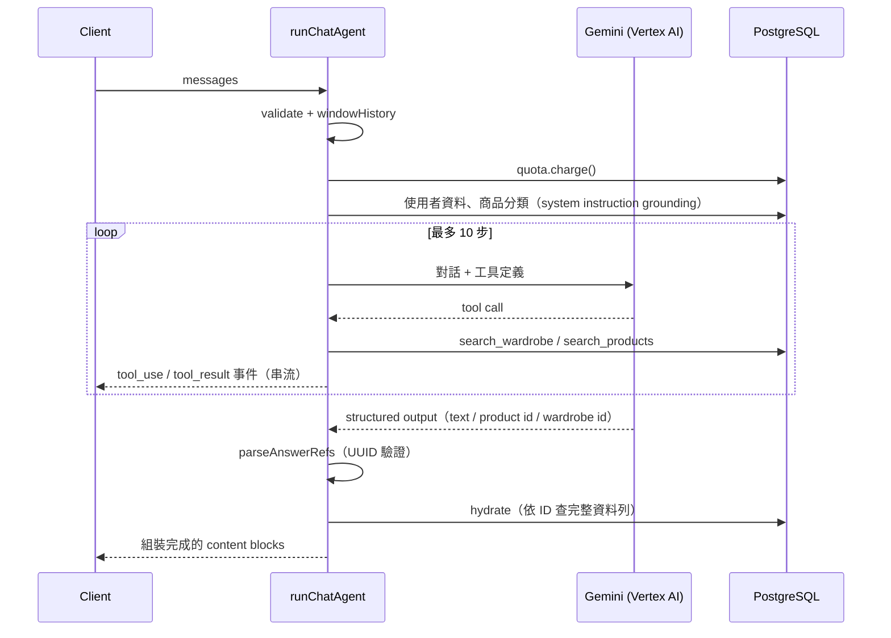

# fashion-agent

[Tryzeon](https://github.com/Tryzeon)（創然科技）AI 穿搭助理的 Agent 後端：以 Gemini tool calling 查詢使用者衣櫃與商城商品，產生可直接渲染為商品卡的穿搭推薦。

## 設計原則

**LLM 負責判斷，資料庫負責事實。**

模型只能透過工具取得商品資料，最終回覆只輸出商品 ID；名稱、價格、尺寸等事實一律由後端依 ID 回查資料庫後組裝。因此每一張渲染出的商品卡都必定對應到資料庫中實際存在、且使用者有權讀取的資料列，這項保證由程式結構提供，不依賴模型遵守指令。

## 處理流程



任何步驟 throw 時，已扣除的額度會退還；模型未產出符合 schema 的答案則降級為固定的追問文字。

## 主要設計

- **Tool calling 與執行上限**：兩個工具 `search_wardrobe`、`search_products`，參數以 Zod 定義，enum 值直接取自資料庫 enum。Agent loop 以 `stepCountIs(10)` 限制步數。
- **Error-as-value**：工具不 throw，查無資料回傳空結果，參數不合法回傳錯誤原因，讓模型在同一個 loop 內修正並重試。含不合法值的篩選欄位整欄拒絕，避免模型誤以為篩選已生效。
- **Structured Output + Hydration**：最終答案為有序的 `text` / `product` / `wardrobe` block 陣列，商品類 block 只帶 ID，由 `hydrate.ts` 批次查詢後組裝；查無資料的 ID 直接捨棄。
- **ID 驗證**：解析階段即過濾非 UUID 格式的 ID，避免單一抄錯的 ID 使整批 `IN` 查詢因 Postgres 22P02 錯誤而失敗。
- **Context 管理**：完整重播 tool_use / tool_result；已推薦商品於歷史中壓縮為 ID 參照；搜尋結果只傳有值欄位。超過 400 則訊息時依 turn 邊界截斷，確保不留下無對應 tool_use 的 tool_result。
- **額度補償**：執行前扣額度，後續失敗即退還；退還失敗只記錄，不覆蓋原始錯誤。
- **權限邊界**：核心不假設 RLS 存在。使用 session client 時由 Row-Level Security 限制可讀範圍，使用 admin client 時由查詢中明確的 `user_id` 篩選把關。

## 使用方式

```ts
import { runChatAgent } from "./agent/chat/run.ts";
import { supabaseChatQuota } from "./agent/chat/quota.ts";

const { blocks, messages, usage } = await runChatAgent(
  userClient, // 呼叫者自己的 Supabase client，決定 RLS 邊界
  {
    userId,
    messages: [{ role: "user", content: [{ type: "text", text: "幫我配一套秋天約會的穿搭" }] }],
    onEvent: (event) => stream.write(event), // tool_use / tool_result
  },
  { quota: supabaseChatQuota(adminClient) },
);
```

| 回傳值 | 說明 |
|---|---|
| `blocks` | 組裝完成的回覆，`product` / `wardrobe` block 帶有完整資料列 |
| `messages` | 本回合新增的訊息（每次 tool call、tool result 與最終回答），供呼叫端保存對話 |
| `usage` | 扣除後的當日額度 |

`runChatAgent` 的 context loader、agent runner、hydrator 皆可透過第三個參數注入，單元測試即以此在不連線模型與資料庫的情況下涵蓋完整流程。

## 環境變數

| 變數 | 必要 | 說明 |
|---|---|---|
| `GOOGLE_SERVICE_ACCOUNT` | 是 | GCP service account 金鑰 JSON 全文 |
| `CHAT_MODEL` | 是 | Vertex AI 上的 Gemini 模型 ID |
| `VERTEX_LOCATION` | 否 | Vertex AI 區域，預設 `global` |

## 專案結構

```
agent/
├── chat/
│   ├── run.ts            進入點：驗證 → 額度 → grounding → agent loop → hydration → 組裝
│   ├── validate.ts       對話結構與長度驗證、歷史截斷
│   ├── context.ts        system instruction（使用者資料、商品分類、分流規則）
│   ├── vertex.ts         Agent loop（streamText、10 步上限、structured output）
│   ├── tools.ts          工具定義與執行、最終答案 schema
│   ├── logic.ts          純函式：篩選驗證、訊息轉換、答案解析、歷史視窗
│   ├── hydrate.ts        依 ID 批次查詢資料列
│   ├── quota.ts          chat 額度計數器
│   ├── styling-guide.ts  穿搭規則
│   └── types.ts          對話 schema、介面與上限
├── vertex/
│   ├── provider.ts       Vertex AI provider（service account 認證）
│   ├── config.ts         環境變數讀取
│   ├── compact-body.ts   逐 chunk 複製回應，避免大型回應佔用過多記憶體
│   └── errors.ts         429 / 503 判定為服務忙碌
├── quota.ts              每日額度扣除與退還（Postgres RPC）
├── errors.ts             跨功能的錯誤分類
├── database.types.ts     Supabase 產生的資料庫型別
└── …                     共用的驗證、文字與 enum 工具
```

## 技術棧

Deno 2 · TypeScript · [AI SDK](https://ai-sdk.dev) 6 · Gemini on Vertex AI · Zod 4 · Supabase（PostgreSQL、RLS）

## 開發

```bash
deno task test     # 單元測試
deno task check    # 型別檢查
```
